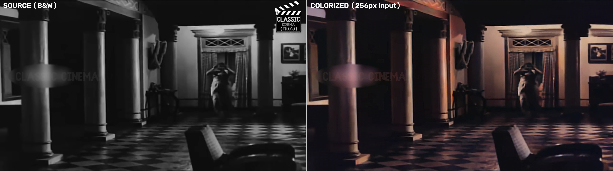

# Gundamma Katha — AI Colorization Pipeline

AI-powered restoration of the 1962 Telugu classic **Gundamma Katha** from Black & White to full colour, upscaled to 4K.

> **Film:** Gundamma Katha (1962) · Directed by B. Vittalacharya & Adurthi Subba Rao
> **Cast:** N.T. Rama Rao, Akkineni Nageswara Rao, Savitri, Jamuna
> **Source:** 1920×1080 B&W HD print

---

## Sample Output



*Left: Original B&W source frame — Right: AI Colorized output (DDColor, 256px inference)*

---

## How It Works

The pipeline runs in **three stages**:

```
Source B&W MP4
      │
      ▼
┌─────────────────────────────────────────────┐
│  PASS 1 — Watermark Removal + AI Colorize   │
│  • Mirror-fill top-right clap logo          │
│  • Gaussian blur "CLASSIC CINEMA" watermark │
│  • DDColor batched GPU inference (8 fr/call)│
│  • Per-frame sharpening                     │
└─────────────────────────────────────────────┘
      │
      ▼
┌─────────────────────────────────────────────┐
│  PASS 2 — Residual Watermark Suppression    │
│  • Re-check colorized frames for residual   │
│    watermark brightening caused by DDColor  │
│  • Targeted Gaussian blur on dark zones     │
└─────────────────────────────────────────────┘
      │
      ▼
┌─────────────────────────────────────────────┐
│  FFmpeg — 1080p Intermediate                │
│  • libx264, CRF 15, AAC 192k audio merge   │
└─────────────────────────────────────────────┘
      │
      ▼
┌─────────────────────────────────────────────┐
│  FFmpeg — 4K Final Output                  │
│  • Lanczos upscale → 3840×2160             │
│  • Unsharp mask for detail recovery        │
│  • libx264, 8 Mbps cap (< 10 GB for 2h38m)│
└─────────────────────────────────────────────┘
      │
      ▼
Gundamma_Katha_Full_Colorised_4K.mp4
```

---

## AI Models

### DDColor (Primary — Production Pipeline)
- **Model:** [`piddnad/ddcolor_artistic`](https://huggingface.co/piddnad/ddcolor_artistic) (HuggingFace)
- **Architecture:** MultiScaleColorDecoder with ConvNeXt backbone
- **Inference size:** 256×256 (4× fewer ops vs 512, minimal quality difference)
- **Used by:** `colorize_pipeline_full_fast.py`, `colorize_pipeline_v2.py`

### Zhang et al. ECCV16 (Early Experiments)
- **Model:** `colorization_release_v2.caffemodel` (auto-downloaded ~130 MB)
- **Config:** `models/colorization_deploy_v2.prototxt`
- **Architecture:** Caffe CNN, 224×224 input, L→AB prediction
- **Reference:** [Zhang et al., "Colorful Image Colorization", ECCV 2016](https://richzhang.github.io/colorization/)
- **Used by:** `colorise_engine.py`, `colorise.sh`

---

## Repository Structure

```
GK/
├── colorize_pipeline_full_fast.py   # Production pipeline (batched DDColor) ← MAIN
├── colorize_pipeline_full.py        # Full movie pipeline (single-frame)
├── colorize_pipeline_v2.py          # v2 pipeline (2-min test clip)
├── colorize_pipeline.py             # Initial pipeline prototype
├── colorise_engine.py               # ECCV16 frame-by-frame engine
├── colorise_engine_v2.py            # ECCV16 engine v2
├── colorise_imax_v3.py              # IMAX quality experiment v3
├── colorise_imax_v4.py              # IMAX quality experiment v4
├── colorise.sh                      # Bash entry point (venv + batch processing)
├── run_ramudu_pipeline.sh           # Pipeline runner (Ramudu)
├── run_test_imax.sh                 # IMAX test runner
│
├── colorizers/                      # Zhang et al. colorization package
│   ├── __init__.py
│   ├── base_color.py
│   ├── eccv16.py                    # ECCV16 model definition
│   ├── siggraph17.py                # SIGGRAPH17 model definition
│   └── util.py                      # Preprocessing / postprocessing utilities
│
├── models/
│   └── colorization_deploy_v2.prototxt   # Caffe model architecture (ECCV16)
│
└── output/
    ├── gundamma_full_colorize.log   # Full run processing log
    └── progress_check.jpg           # B&W vs colorized quality check frame
```

> **Note:** Video files (`.mp4`) and model weights (`.caffemodel`, `.pth`) are excluded from this repo via `.gitignore`. Place source video in a local `Source/` directory.

---

## Requirements

### System Dependencies
```bash
# macOS (Homebrew)
brew install ffmpeg python@3.9
```

### Python Dependencies
```bash
pip install torch torchvision          # PyTorch (MPS support built-in on Apple Silicon)
pip install opencv-python numpy Pillow
pip install scikit-image tqdm
pip install huggingface_hub            # DDColor model download
pip install ipython                    # Required by colorizers/util.py
```

### DDColor Source
```bash
# Clone DDColor to /tmp/DDColor (required by fast pipeline)
git clone https://github.com/piddnad/DDColor.git /tmp/DDColor
```

---

## Usage

### Option 1 — Fast Production Pipeline (Recommended)

Runs DDColor with batched GPU inference (8 frames/call) → 1080p → 4K output.

```bash
# Update paths inside the script first, then:
python3 colorize_pipeline_full_fast.py
```

**Key configuration (top of script):**
```python
BATCH      = 8      # frames per GPU call
INPUT_SIZE = 256    # inference resolution (256 = fast, 512 = higher quality)
USE_FP16   = False  # fp16 not supported on MPS ConvNeXt
```

**Output files (local, not in repo):**
```
/tmp/gundamma_full_tmp1.mp4        # Pass 1 intermediate
/tmp/gundamma_full_1080p.mp4       # 1080p with audio
Output/Gundamma_Katha_Full_Colorised_4K.mp4   # Final 4K
```

---

### Option 2 — Bash Entry Point (ECCV16, Batch)

Auto-creates venv, downloads model weights, processes all files in `Source/`.

```bash
# All files in Source/
./colorise.sh

# Single file
./colorise.sh -f movie.mp4

# Help
./colorise.sh -h
```

---

### Option 3 — Python Engine (ECCV16, Single File)

```bash
python3 colorise_engine.py <input_video.mp4> <output_silent.mp4>
```

---

## Performance

Tested on **Apple M-series (MPS backend)**:

| Pipeline | Model | Batch | Speed | 4K Output Size |
|---|---|---|---|---|
| `colorize_pipeline_full_fast.py` | DDColor artistic | 8 | ~0.92× realtime | ~9–10 GB (8 Mbps cap) |
| `colorize_pipeline_v2.py` | DDColor artistic | 1 | ~0.2× realtime | — |
| `colorise.sh` / `colorise_engine.py` | ECCV16 | 1 | ~0.1× realtime | — |

> **Speedup notes:**
> - Batch size 8 gives ~4–6× faster Pass 1 vs single-frame inference
> - `INPUT_SIZE=256` gives 4× fewer FLOPs vs 512 with minimal visible quality loss
> - FP16 is disabled — MPS ConvNeXt backend does not support it

---

## Watermark Handling

The source print has two watermarks that require suppression:

| Watermark | Location | Pass 1 Strategy | Pass 2 Strategy |
|---|---|---|---|
| Clap board logo | Top-right `y:0–232, x:1688–1920` | Mirror-fill from adjacent pixels | — |
| "CLASSIC CINEMA" text | Center `y:290–440, x:12–470` | Gaussian blur σ=25 (dark scenes only, max<80) | Gaussian blur σ=10 (if median<35 and max<185) |

Pass 2 catches cases where DDColor amplifies faint watermark residuals in dark scenes.

---

## Pipeline Log

The full processing log from the Gundamma Katha run is available at [`output/gundamma_full_colorize.log`](output/gundamma_full_colorize.log).

---

## References

- Zhang, R., Isola, P., & Efros, A. A. (2016). **Colorful Image Colorization**. ECCV 2016. [Paper](https://arxiv.org/abs/1603.08511) · [GitHub](https://github.com/richzhang/colorization)
- Kang, X., Yang, T., Ouyang, W., et al. (2023). **DDColor: Towards Photo-Realistic Image Colorization via Dual Decoders**. ICCV 2023. [Paper](https://arxiv.org/abs/2212.11111) · [HuggingFace](https://huggingface.co/piddnad/ddcolor_artistic)
