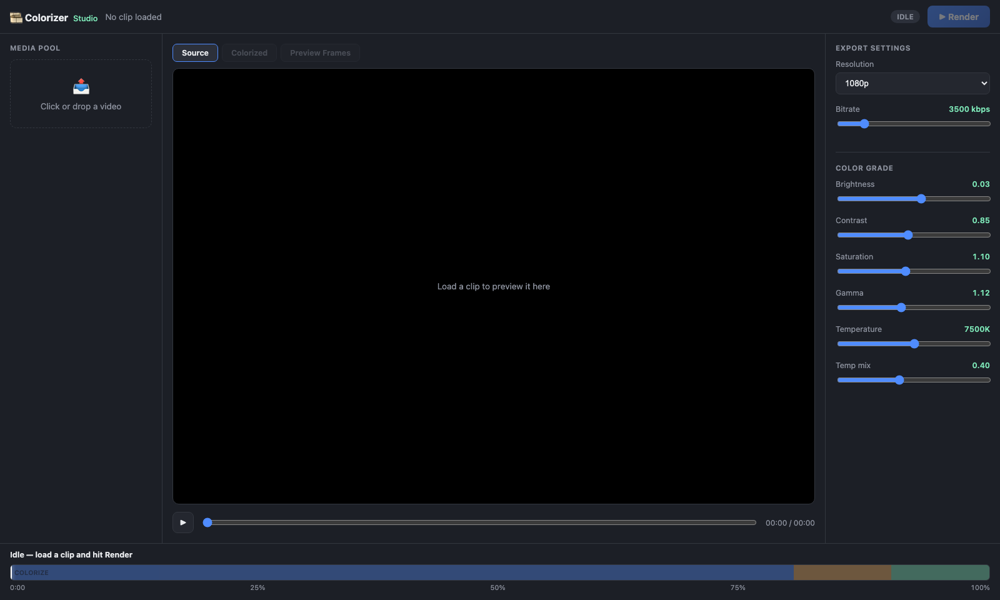
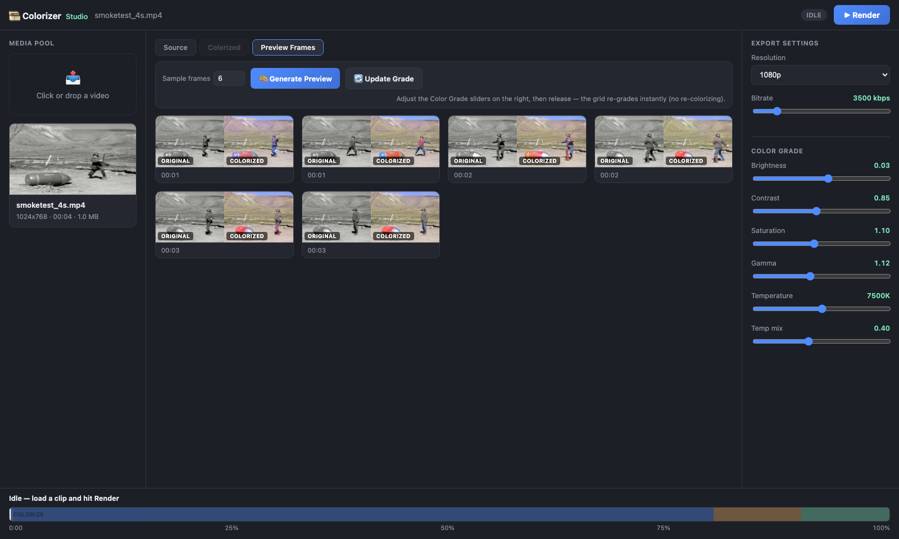
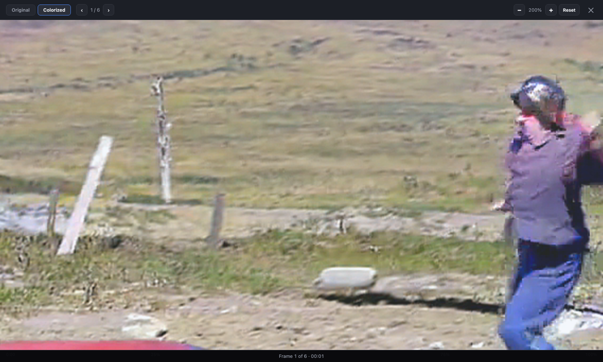
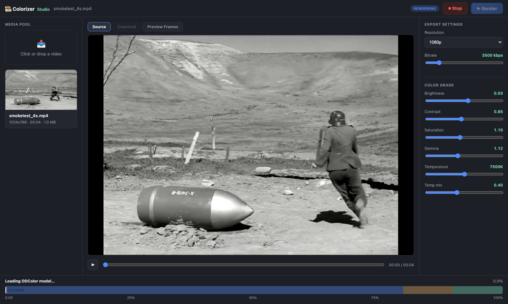

# Colorise

AI black & white → color video restoration, built around [DDColor](https://github.com/piddnad/DDColor). Two things live in this repo:

- **[`WebUI/`](WebUI/)** — *Colorizer Studio*, a local web app: drag in any B&W video, tune the color grade, preview it on a handful of sample frames in seconds, then render the full colorized/upscaled/bitrate-capped output.
- **Root-level scripts** — the underlying CLI pipeline (`colorize_full_movie.py` and friends) that the web app wraps, for scripted/batch use.
- **[`GK/`](GK/)** — an earlier, self-contained colorization pass built specifically for *Gundamma Katha* (1962); kept as-is, see its own [README](GK/README.md).

---

## Colorizer Studio (WebUI)

A single-page app modeled on a compact NLE (media pool / preview / properties / timeline) instead of a bare upload form — because DDColor inference is slow enough (roughly 1-4 fr/s on Apple Silicon MPS, hardware-dependent) that you want to judge color before committing to an hours-long render, and want to be able to stop one that's already running.

### Load a clip and preview the source




### Preview colors on a few sample frames before the full render

Colorizes 2-10 frames spread across the clip (~2s/frame after the one-time model warm-up) instead of the whole movie. Move any Color Grade slider and release it — the grid re-grades in about a second, because it's just re-running the fast ffmpeg grade filter over already-colorized frames, not DDColor again.



### Click a sample to enlarge it — zoom, pan, compare tabs



Scroll wheel or `+`/`-` to zoom (up to 6x), drag to pan once zoomed, double-click for a quick 2.5x, arrow keys to step through the other sample frames, `Esc` or click-outside to close.

### Render the full clip, with live progress and a Stop button



The timeline strip is weighted by where time actually goes — colorize (80%), encode pass 1 (10%), encode pass 2 (10%) — and fills accordingly, with frame count / fr/s / ETA from the worker. **Stop** kills the render's whole process group (worker **and** any ffmpeg pass it spawned), not just the parent, so nothing is left running in the background.

### Run it

```bash
cd WebUI
python3 app.py
# -> http://127.0.0.1:5151
```

Requires `flask`, `opencv-python`, `torch`, `huggingface_hub`, and a local [DDColor](https://github.com/piddnad/DDColor) checkout on the Python path (see `colorize_lib.py` for the expected location). Each render runs as its own subprocess (`worker.py`) rather than in-process — a fresh process measurably avoids MPS memory slowdown over long sustained runs; the sample-frame preview endpoint, being a handful of frames, keeps one model warm in the Flask process instead.

**Layout:**
```
WebUI/
├── app.py            Flask backend — upload, job lifecycle, cancel, sample-frame preview endpoints
├── worker.py          per-render subprocess: DDColor colorize + 2-pass bitrate-targeted ffmpeg encode
├── colorize_lib.py     shared DDColor inference + grade-filter helpers (used by both app.py and worker.py)
└── static/index.html   the UI — vanilla HTML/CSS/JS, no build step
```

---

## CLI scripts

| Script | Purpose |
|---|---|
| `colorize_full_movie.py` | Reference pipeline: DDColor colorize + color grade over a full movie or a `--start`/`--duration` test clip, single-pass CRF encode. |
| `colorize_great_dictator_1080p.py` | Same pipeline upscaled to 1080p (aspect-preserving) with a 2-pass bitrate-targeted encode instead of CRF, so output size is predictable. |
| `colorize_clip_only.py` | Colorize a short clip only, no watermark removal / upscaling. |
| `colorize_pipeline_full.py` / `colorize_pipeline_full_fast.py` | Fuller pipeline variants (watermark removal + colorize), the "fast" variant trading detail for speed. |
| `grade_clip.py` | Color-grade an already-colorized clip via the same ffmpeg `eq`/`colortemperature` filter chain, without re-running DDColor. |
| `remove_watermark_pb.py` | Watermark removal pass used ahead of colorization on some sources. |
| `colorizers/` | Legacy ECCV16/SIGGRAPH17 colorization nets ([richzhang/colorization](https://github.com/richzhang/colorization)), predates the DDColor-based pipeline above. |

All of the above assume `ffmpeg`/`ffprobe` on `PATH` and a local DDColor checkout for the model.

---

## What's excluded from this repo

Per `.gitignore`: source movies (`Source/`), rendered/colorized outputs (`Output/`), and the WebUI's per-run data (`WebUI/uploads/`, `WebUI/jobs/`, `WebUI/outputs/`, `WebUI/previews/`) — all generated or user-supplied media, not source code. Nothing under `GK/` was touched by any of the above.
